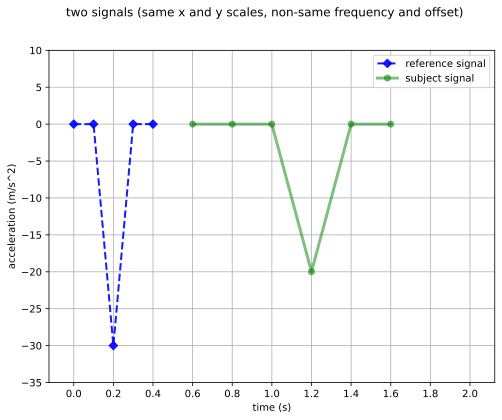

# Cross-Correlation

## Introduction

The cross-correlation implements the following conceptual steps:

* Given two signals
  * *r(t)* is the **reference** signal with bounds *[r_a, r_b]*.
  * *s(t)* is the **subject** signal with bounds *[s_a, s_b]*.
* Synchronization:
  * Find the global minimum *T_a = min(r_a, s_a)*.
  * Find the global maximum *T_b = max(r_b, s_b)*.
  * Construct a global time interval *[T_a, T_b]*.
  * Choose a global time step, *DT*, to be the minimum of the reference time step and the subject time step. 
* Correlation:
  * Keep the reference signal stationary.  Move the subject signal along the *t* axis until the last data point of the subject signal is multiplied with the first data point of the reference signal.
  * Then, slide the subject signal to the right on the *t* axis by *DT*, calculating the inner product of the two signals for each *DT* in *[T_a, T_b]*.
  * Find the largest value of the foregoing inner products, and then for that *DT* step, move the subject curve to align with the reference curve.  This will represent the highest correlation between the reference and the signal.

## Example: 

* two triangular acceleration pulses, with 
  * time integration and 
  * cross-correlation

Input file: [correlation_recipe.json](correlation_recipe.json)

Outputs:

Error metrics:

* cross-correlation relative error: 33 percent
* L2-norm error rate: 102 percent

## Example: 

* sawtooth examples of [Anomaly site](https://anomaly.io/understand-auto-cross-correlation-normalized-shift/)

Input file: [anomaly_recipe.json](anomaly_recipe.json)

Outputs:

Error metrics:

* cross-correlation relative error: 2.5 percent
* L2-norm error rate: 8.3 percent

## Example: Unit test case.

* For more examples, see the unit test examples in [test_correlation.py](test_correlation.py).