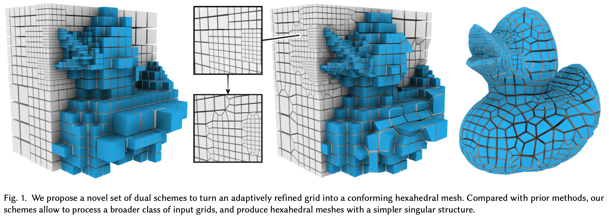

# Gena

* We will use `Gena` as a short name for *Generalized Adaptive Refinement for 
Grid-based Hexahedral Meshing*

## Overview

The **goal** of this document is to record the steps required to get [CinoLib](https://github.com/mlivesu/cinolib), created by Livesu and contributors, installed and running as a **local user workflow** to produce a hexahedral mesh from a surface representation.  This workflow requires the 
[Gen-Adapt-Ref-for-Hexmeshing repository](https://github.com/cg3hci/Gen-Adapt-Ref-for-Hexmeshing).

The specific example will be the duck model shown in the figure below (originally created in, and reproduced from [Livesu 2021b](references.md#livesu-2021b)).


> *Figure 0.1:  Reproduction from Fig. 1 of [Livesu 2021b](references.md#livesu-2021b).*

[References](references.md)

## Preconditions

### cmake

The `cmake` application must already be present.
Test for an existing installation:

```bash
~✔> which cmake

```

If the result from the above-stated command returns nothing, then
install either with a [CMake installer](https://cmake.org/download/) 
with [Homebrew](https://brew.sh/) as follows:

```bash
~✔> brew install cmake
```

### cinolib

The current repository will include `cinolib` as a submodule.

### Gurobi for IPL resolution


### CGAL for computation of the Shape Diameter Function (SDF)


## Getting Started


