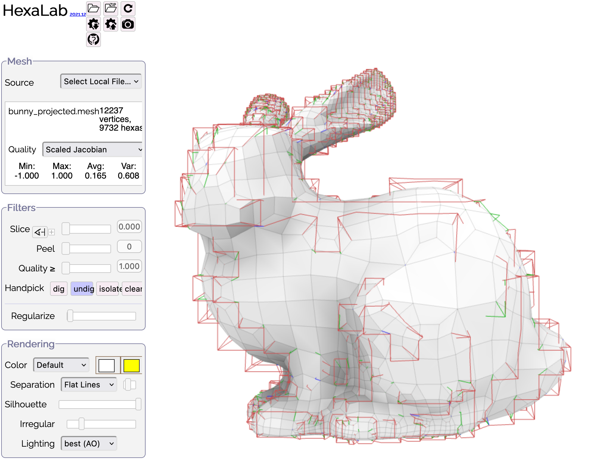
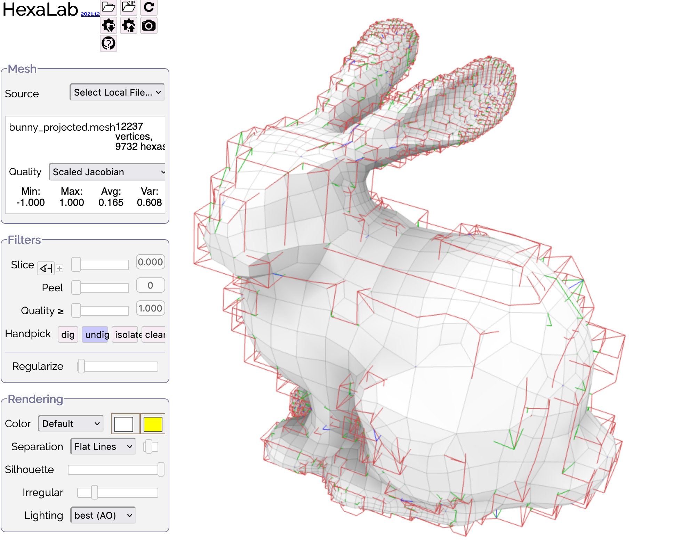

# Question and Answer

## 2022-04-20

### Q1: Roundings:

Please see https://github.com/sandialabs/sibl/blob/master/geo/doc/cinolib/sphere.md#roundings

### Q2: Histograms:

Please see https://github.com/sandialabs/sibl/blob/master/geo/doc/cinolib/sphere.md#metrics

### Q3: Half-space images:

In the  images, you have a primal domain and a dual domain.  Within each domain, the elements outside the object boundary are gray and the elements inside the object boundary are blue.  How did you create these two images, that is, making a half-space background in gray elements and an adjunct half-space object in blue elements?

## 2022-03-27 Gubrobi

### Q: Is there a workflow that does not require Gubroi?

A: Yes, "...you could used the classical octree-based pairing strategy,
which is purely algorithmic and does not require solving a 
numerical problem." [ML 2022-03-28] 

The [Pitzalis_2021_generalized_adaptive_refinement](../ref/Pitzalis_2021_generalized_adaptive_refinement.pdf)
paper shows the (OP + WB) worklow, which does not use Integer
Linear Programming (ILP) and hence does not require Gurobi.  

Gurobi makes possible the ILP (GP + WB) workflow, which provides smaller 
hexahedral count than (OP + WB).

Gurobi is currently the fastest existing ILP solver.  Alternatively, open 
source solvers could be used, they are just slower.  Fro example, 
Google's OR-tools (https://developers.google.com/optimization) is an option.

### Q: How is the octree-based pairing strategy invoked?

A: Use the `--use_octree` option when invoking the `make_grid` binary.

All of the octree-based pairing code is in 
https://github.com/cg3hci/Gen-Adapt-Ref-for-Hexmeshing and there is no 
separate repository for the octree-based code, even though the ILP 
strategy is preferred over the octree-based strategy since fewer hexahedral
elements result with the ILP approach. [LP 2022-03-28]

### Q: Why do red lines appear as in the following?

| Irregular nonzero | Irregular zero |
|:--:|:--:|
|  |  |

A: Red lines "...are internal irregular edges that remained outside of the shape
because only boundary nodes have been projected on the target surface... you can
disable the visualization of singular edges in Hexalab [using the] dedicated 
slider at that the bottom part of the side bar, just position the slider at the
left maximum." [ML 2022-03-28]

## 2022-01-18-0221 Qt Independence

This is a nice coincidence. Just yesterday [2022-01-17] I committed a major update to cinolib which completely removes the dependency from Qt. In the current version cmake is used as a building system, and the GUI is in the hands of GLFW and ImGui. It should work just out of the box, give it a try and let me know if you have any issue with the new version.

BTW: the comment you have at the end of https://github.com/sandialabs/sibl/blob/master/geo/doc/cinolib.md about figure 5 is correct. It was a typo and has been corrected in the TOG version of the paper. The arxiv version is actually old, I suggest you take a look at this one http://pers.ge.imati.cnr.it/livesu/papers/LPC21/LPC21.pdf, there are a few more experiments and novel insight on the previous techniques.

Last year we made two TOG papers on grid-based hexmeshing. Part of the code necessary to build the example you mention is still outside of cinolib, and can be found in this repository: https://github.com/cg3hci/Gen-Adapt-Ref-for-Hexmeshing. Specifically, this repository contains the code necessary to create an adaptive grid with hanging nodes and to enforce balancing and pairing, whereas the schemes to suppress hanging nodes are already inside the library. Eventually everything will be refactored and the whole hexmeshing pipeline will be moved inside cinolib. This is work in progress.

> I would memorialize these steps in a “Getting Started” markdown report, and submit it to your GitHub repository so that others around the world could learn the steps too.

That could be useful, thanks! Even though things may change over time as I mentioned above. The ultimate goal  is to be able to execute the whole pipeline with a single cinolib call, and then expose it to the public :)

BTW, at this link there is an online demo based on our code that you can use to produce hexmeshes http://90.147.146.248/

> Also, I would be very interested in trying to wrap your C++ library for Python users!

This could be really interesting as well. Let's talk about it :)

## 2022-01-17 CinoLib GUI

* Livesu committed major update that removes cinolib dependency on Qt. 
  * `cmake` is used as the build system.
  * GLFW and ImGui handle the GUI.

