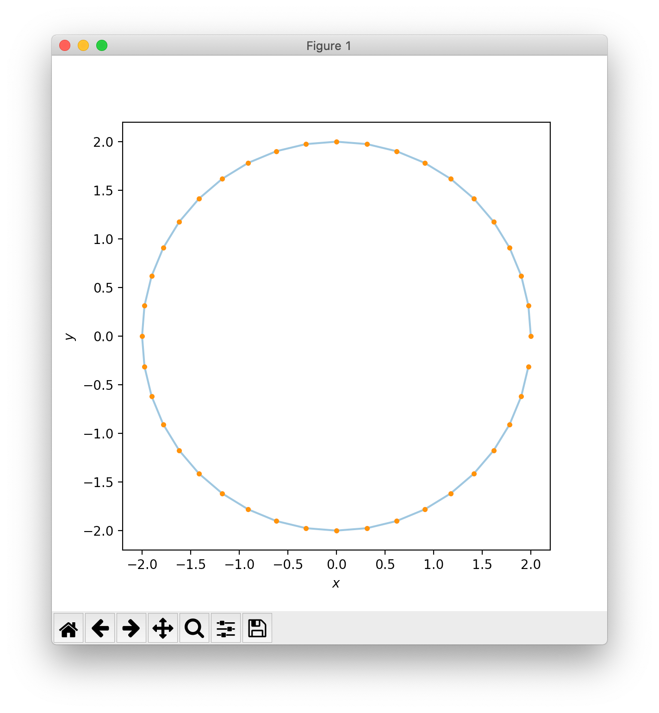

# Lesson 01: Plot a boundary interactively

Prerequisite: [Lesson 00](lesson_00.md)

The **goal** of this lesson is to use the `siblenv` environment to plot a discrete, 2D boundary.

From the command line, activate the `siblenv` environment, then start python.

```bash
> conda activate siblenv
> python
```

Using python interactively, create a boundary composed of `(x, y)` pairs and show the boundary and plot the result:

```python
# type the following into the python terminal

import math
import matplotlib.pyplot as plt

n_samples = 40
radius = 2.0

# parameterize the curve
ts = tuple(range(n_samples))

# create x and y points
xs = [radius * math.cos(2.0 * math.pi * t / n_samples) for t in ts]
ys = [radius * math.sin(2.0 * math.pi * t / n_samples) for t in ts]

s = 6.0  # 6.0 inches
fig = plt.figure(figsize=(s, s))

ax = fig.gca()

ax.plot(xs, ys, "-", alpha=0.5)
ax.plot(xs, ys, ".")

ax.set_aspect("equal")
ax.set_xlabel(r"$x$")
ax.set_ylabel(r"$y$")

plt.axis("on")

plt.show()
```



[ [Index](README.md) ]
[ Next: [Lesson 02](lesson_02.md) ]

