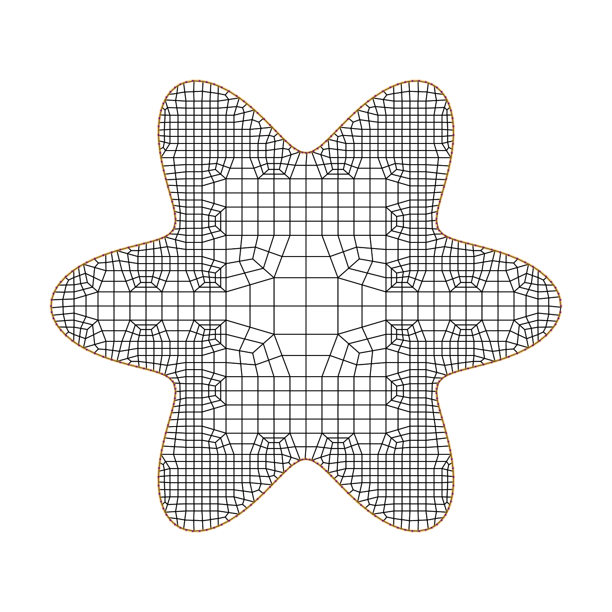

# Lesson 21: Flower

## Goals

Mesh the `flower` domain using dualization, and compare the result to an alternative method and result published in [Rushdi 2017](#rushdi-2017), Figure 15.

## Steps

Verify the following files exist:

* [star.txt](lesson_21/star.txt) - the boundary `x y` discrete point definition
* [lesson_21.yml](lesson_21/lesson_21.yml) - the YAML input file specification

From the command line:

```bash
> conda activate siblenv
> cd ~/sibl
> python geo/src/ptg/main.py -i geo/doc/dual/lesson_21/lesson_21.yml
```

### Outputs

The following will appear in the specified `io_path` folder:

* Mesh file [`lesson_21.inp`](lesson_21/lesson_21_mesh.inp)
* Image file [`lesson_21.png`](lesson_21/lesson_21_figure.png), and shown here:


| | boundary for SHT method |
|:---:|:---:|
|  |  |


| Rushdi Fig. 15 | Dual method |
|:---:|:---:|
|  |  |

[Index](README.md)

## References

### Rushdi 2017

* Rushdi AA, Mitchell SA, Mahmoud AH, Bajaj CC, Ebeida MS. All-quad meshing without cleanup. Computer-Aided Design. 2017 Apr 1;85:83-98.

