# primal/dual quadrilateral transitions

* *See also: [quadtree](quadtree.md)*

## Six Unique Strongly Balanced Transitions

Created with [dual_quad.py](../src/ptg/dual_quad.py) and [plot_dual_quad.py](plot_dual_quad.py):

| Template Key | Primal | Dual |
|:---:|:---:|:---:|
| `key_0000` *L1* |  |  
| `key_0001` *convex* |  |  
| `key_0011` *wave* |  |  |
| `key_0110` *diagonal* |  |  
| `key_0111` *concave* |  |  
| `key_1111` *L2* |  |  | 

## One Unique Weakly Balanced Transition

| Template | Primal | Dual |
|:---:|:---:|:---:|
| `key_0112` *weak* |  |  

## Hash Table

* The hash table is composed
  * 16 strongly balanced templates,
    * Six templates are unique,
    * Ten templates are non-unique, and
  * Four weakly balanced template,
    * One template is unique,
    * Three templates are non-unique.

| `key_0000` | `key_0001` | `key_0010` | `key_0011` | `key_0100` | `key_0101` | `key_0110` | `key_0111` | 
|:------:|:------:|:------:|:------:|:------:|:------:|:------:|:------:|
|  |  |  |  |  |  |  |  |
|  |  |  |  |  |  |  |  |

| `key_1000` | `key_1001` | `key_1010` | `key_1011` | `key_1100` | `key_1101` | `key_1110` | `key_1111` | 
|:------:|:------:|:------:|:------:|:------:|:------:|:------:|:------:|
|  |  |  | 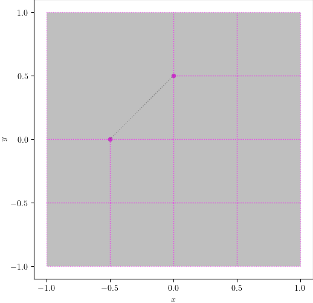 |  |  |  |  |
|  | 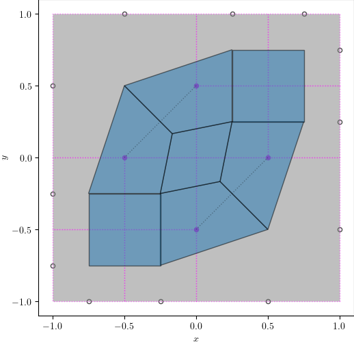 | 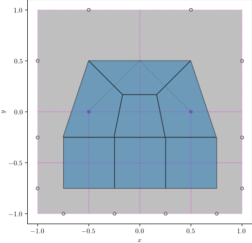 | 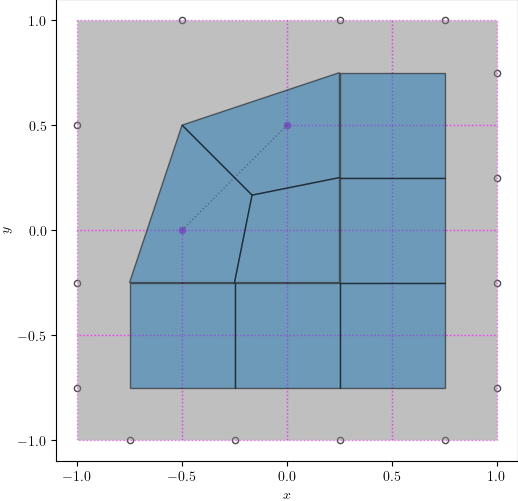 |  |  |  |  |

| `key_0112` | `key_1021` | `key_1201` | `key_2110` |
|:------:|:------:|:------:|:------:|
|  | 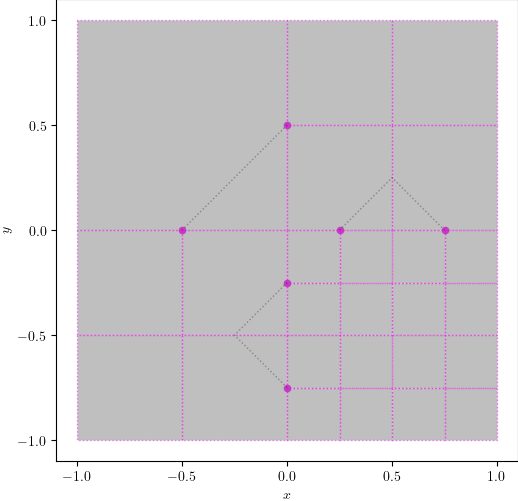 | 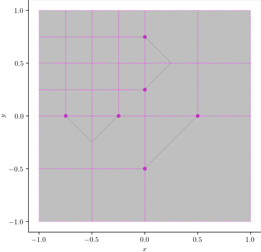 |  | 
|  | 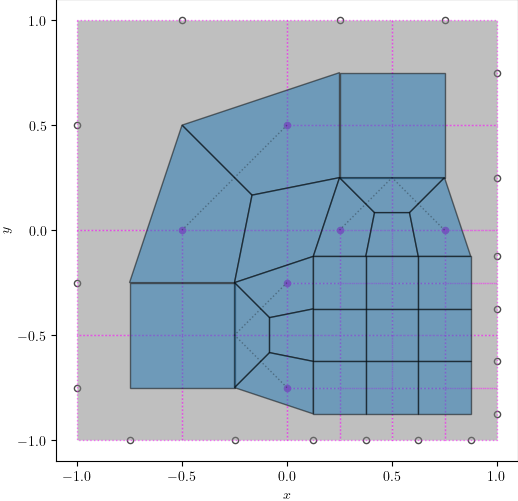 |  | 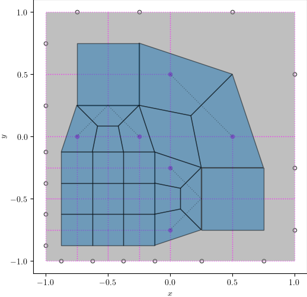 |

## Assembly

| `key_0001_r0_p0` | `key_0001_r0_p1` | `key_0001_r1_p0` | `key_0001_r1_p1` |
|:------:|:------:|:------:|:------:|
| 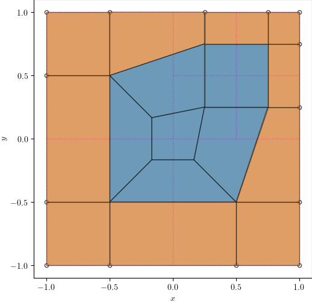 | 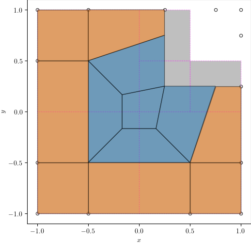 | 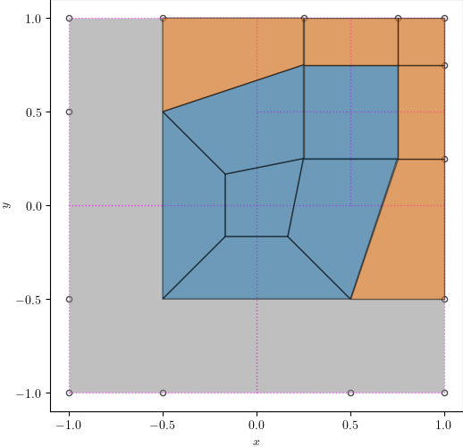 | 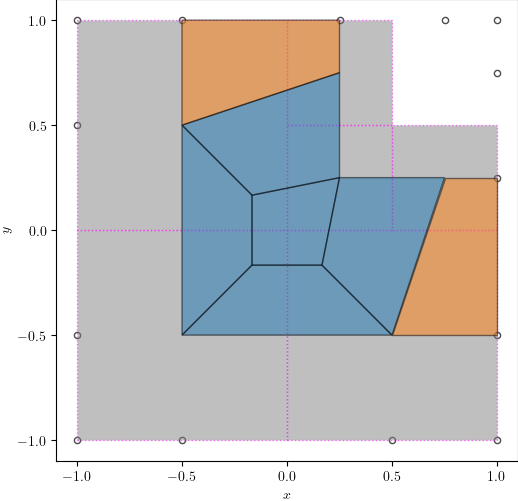 | 

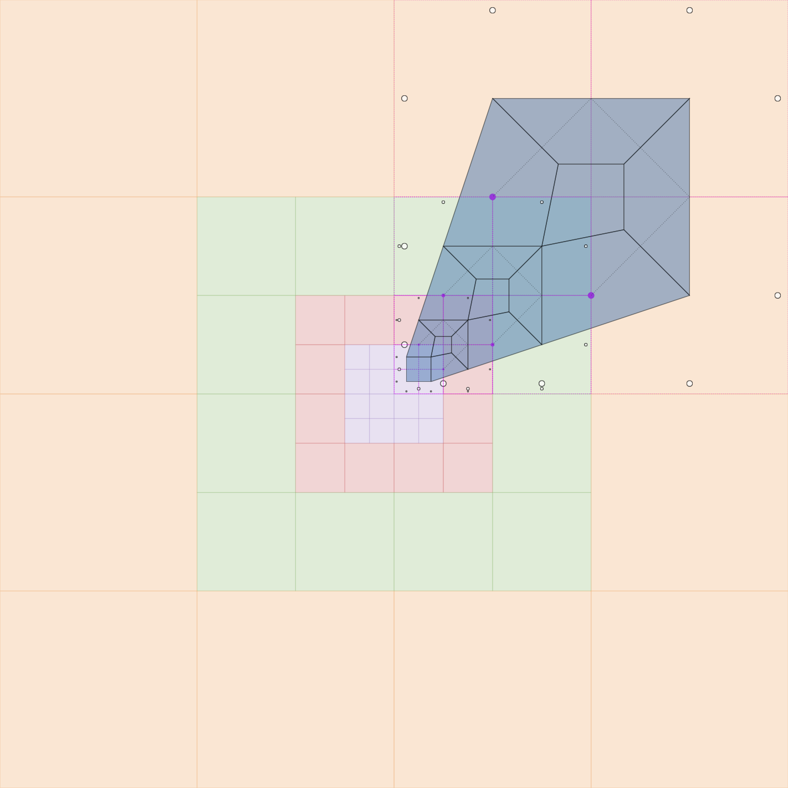
> *Illustration of three concentric levels using the convex transition, Template_0001. The assembled dual mesh is (partly, sufficient to demonstrate symmetric) shown in blue.*