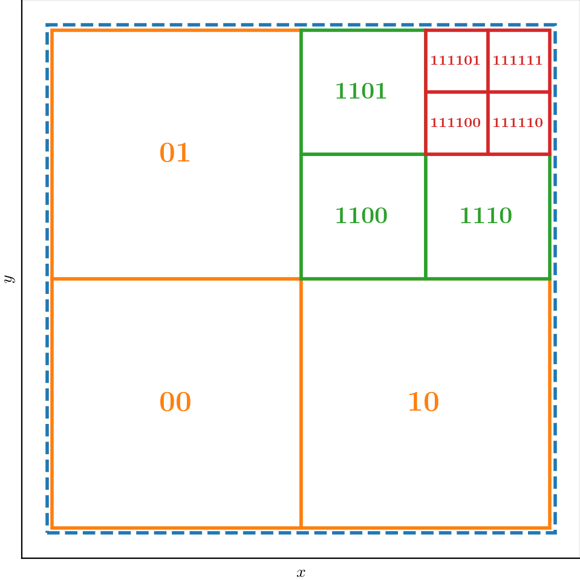
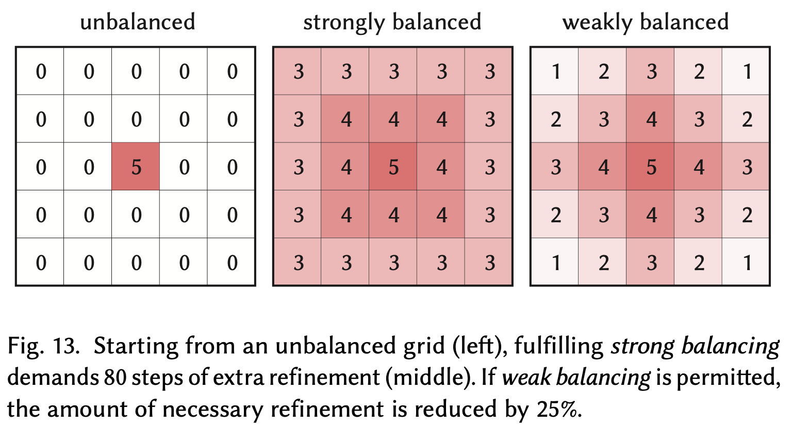
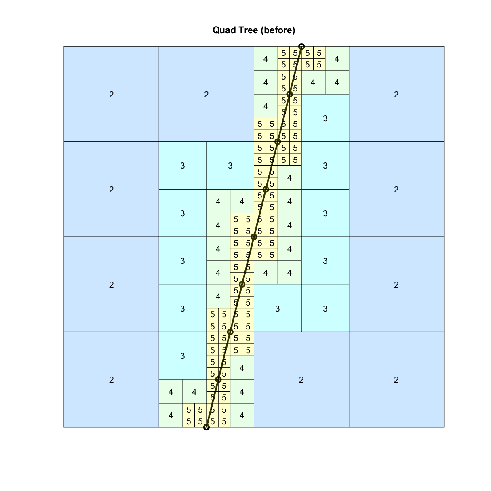
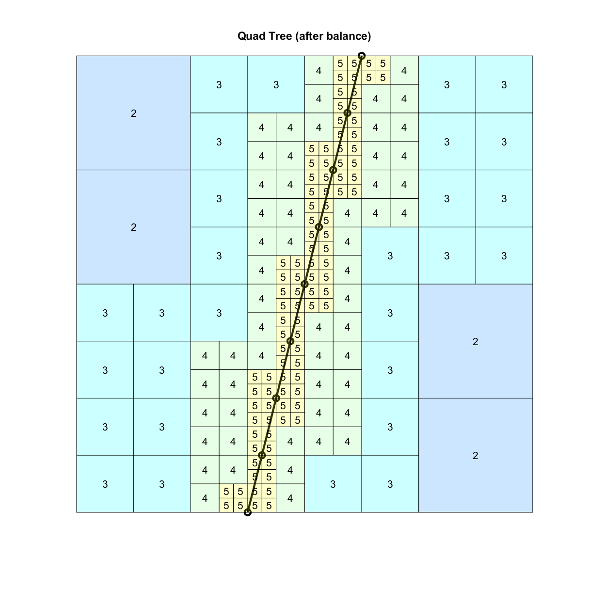
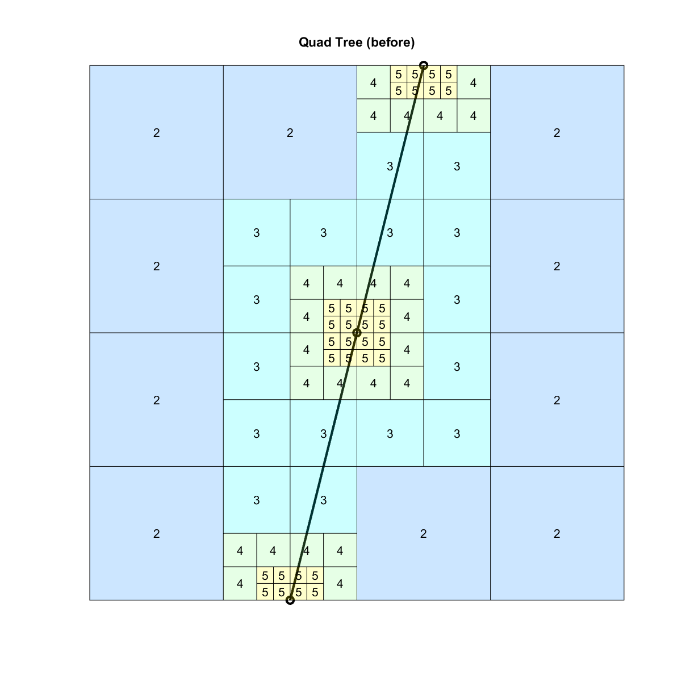
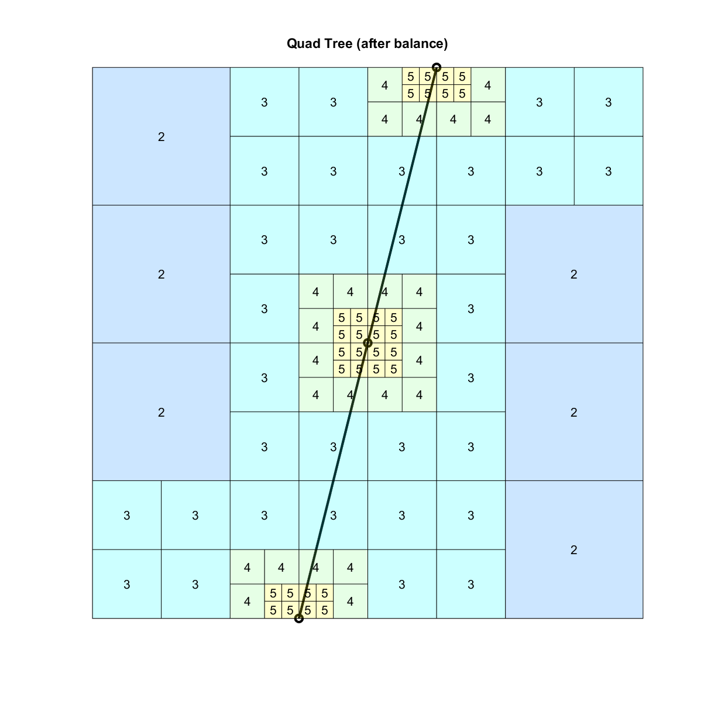
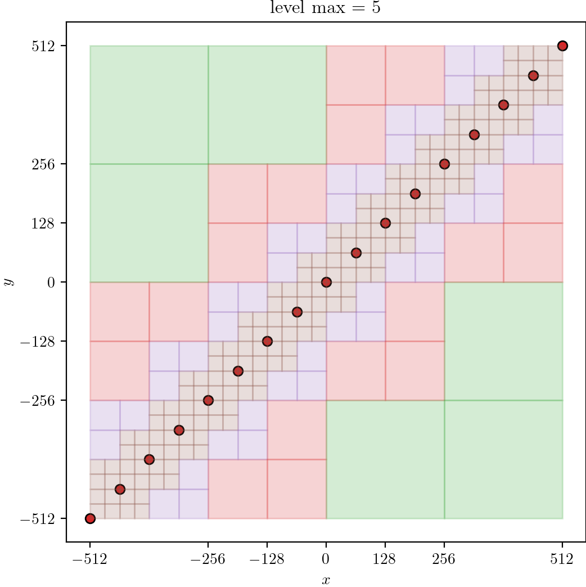

# quadtree

* *See also: [dual_quad_transitions](dual_quad_transitions.md)*

## Numbering Convention

* *x* is the dominant (first) axis
* *y* is the subordinant (second) axis
* Level 0: blue (0 bisections: 2^0 = 1 quad per side length)
  * Level 1: orange (1 bisection: 2^1 = 2 quads per side length)
    * Level 2: green (2 bisections: 2^2 = 4 quads per side length)
      * Level 3: red (3 bisections: 2^3 = 8 quads per side length)

Created with [plot_quadtree_convention.py](plot_quadtree_convention.py):

Created with [fig_quadtree.tex](fig_quadtree.tex):

## Refinement Example

Created with [plot_quadtree.py](plot_quadtree.py):

* `L0` square domain $$(x, y) \in ([1, 3] \otimes  [-1, 1])$$
* Single point at `(2.6, 0.6)` to trigger refinement.

| | | | 
|:---:|:---:|:---:|
 |  |  |
 |  |  |

## Rebalancing

* *strongly balanced* [3D volume] cells that differ by more than one level of refinement must not share any vertex, edge, or face. [Livesu 2021, Section 6]
* *weakly balanced* [3D volume] cells that differ by more than one level of refinement must not share any face.

> Our key observation is that when there is high disparity in the refinement associated to nearby cells, satisfying the strong balancing criterion requires a conspicuous amount of additional refinement, significantly increasing the cell count. Conversely, if the balancing criterion was weaker, meaning that restrictions applied only to face-adjacent cells, the amount of necessary subdivisions would be much lower (Figure 13).
> 
> Weakly balanced grids may contain edges shared between cells with three different levels of refinement, and vertices incident to cells spanning four different levels of refinement. Luckily, the vertex case does not require any special handling because – regardless of the size disparity – any grid vertex has 8 incident cells and 6 incident edges, which means that it always yields a hexahedron in the dual mesh. This is also the reason why weakly balanced grids in 2D do not necessitate dedicated schemes. Conversely, edges shared by cells spanning three levels of refinement generate hanging vertices that must be incorporated into the mesh connectivity. As shown in Figure 11 there are four possible cases, which correspond to an open concave edge, or a concave corner where 1, 2 or 3 of the incident concave edges contain additional hanging vertices.

### Preminary Results

Created with [plot_quadtree.py](plot_quadtree.py) and C++/MATLAB.

| before (unbalanced) | after (weakly balanced) |
|:---:|:---:|
|  # boundary points = 9 |  # boundary points = 9|
|  # boundary points = 9 |  |
|  # boundary points = 5 | |
|  # boundary points = 9 |  # boundary points = 9|
|  # boundary points = 3 | |

### Remark: Number of Boundary Points

For computation, the boundary is described by discrete boundary points that lie along the continuous boundary.  Sufficient boundary point density to approximately the continuous boundary 
* is required to maintain sufficient quad tree refinement along the path of the boundary 
* is determined by the maximum level of quad tree refinement

Compare the above three cases, with # boundary points, `nbp`, as 3, 5, 9, and respectively, # of boundary intervals, `nbi`, as 2, 4, 8.
* Assume the length dimension is in millimeters, for concreteness of this discussion.  
* All three cases have the `L0` side length as 1024-mm, and maximum number of refinements, `level_max`, as 5.  
* The smallest quad tree side length is
  * `Ln = 1024-mm / (2^n) = ...`
  * `L5 = 1024-mm / (2^5) = 32-mm`
* To maintain continuity of the 4x4 brown square region, the `L5` refinement, the boundary maximum point-to-point interval distance, `ppd_max`, in either the `x` or the `y` direction must be no greater than `4 * 32-mm`, which provides 2 side lengths from each of the two square regions, totaling 4 brown squares on the interval from point-to-point.
* Generally, if the smallest side length is `Ln = L0 / (2^n)`
  * then `ppd_max = 4 * Ln = 4 * L0 / (2^n)`
  * If the number of quad tree bisections `n` increases, the boundary maximum point-to-point interval distance `ppd_max` decreases.  This makes sense because a successive bisection refinement causes the quad tree side length to be halved.
  * <u> **The goal then is to create a boundary with sufficient density such that `ppd < ppd_max`.** </u>
* Also, a distinction for *open* versus *closed* boundaries:
  * `nbi`, the number of boundary intervals, relates to `npb`, the number of boundary points, as
    * `nbi = nbp` for a closed boundary, and
    * `nbi = nbp - 1` for an open boundary.
* Checking the above example
  * `ppd_max = 4 * 1024-mm / (2^5) = 128-mm`
  * This result indicates that even `npb = 9` may be insufficiently low in point density.
    * The boundary length = `sqrt(256^2 + 1024^2) = 1056-mm`.
    * For the *open* boundary example here, 
      * `nbp = 9` means there are `nbi = 8` intervals.
      * For each interval, `ppd = 1056-mm / 8 = 132-mm`, which exceeds `ppd_max = 128-mm` by 3-percent.
  * The worst-case scenario for this example would be if the boundary ran on the domain diagonal and the `nbp` remained 9.  In this case
    * The boundary length = `sqrt(1024^2 + 1024^2) = 1024 * sqrt(2) = 1448-mm`.
    * For each interval, the `ppd = 1448-mm / 8 = 181-mm`, which exceeds the `ppd_max = 128-mm` by 41-percent.  
    * This result makes sense as the `sqrt(2) = 1.41` hypotenuse factor in this configuration gives rise to the 41-percent increase.  
    * Do gaps appear in the boundary for the diagonal with `nbp = 9` case?
      * `No` if the continuity condition is vertex continuity only.
      * `Yes` if the continuity condition is edge continuity.
      * Edge continuity is a stronger continuity condition than vertex continuity.
      * The quad tree refinement changes because 
        * the `nbp = 9` results in a `ppd = 181-mm`, which exceeds `ppd_max = 128-mm` by 41-percent.  
        * With `nbp = 17` (thus `nbi = 16` for an open curve), `ppd =  90.5-mm`, which does not exceed the `ppd_max = 128-mm` value.

| `nbp = 9` | `nbp = 17` |
|:---:|:---:|
|  |  |
> Illustration of worst-case continuity condition (left) with `nbp = 9` and `ppd = 181-mm`compared to a single additional bisection (right) with `nbp = 17` and `ppd = 90.5-mm`.  For `boundary_length = 1448-mm` and `level_max = 5`, `ppd_max = 128-mm`.

| `nbp = 9` | `nbp = 17` |
|:---:|:---:|
|  |  |
> Illustration of original case continuity condition (left) with `nbp = 9` compared to a single additional bisection (right) with `nbp = 17`.