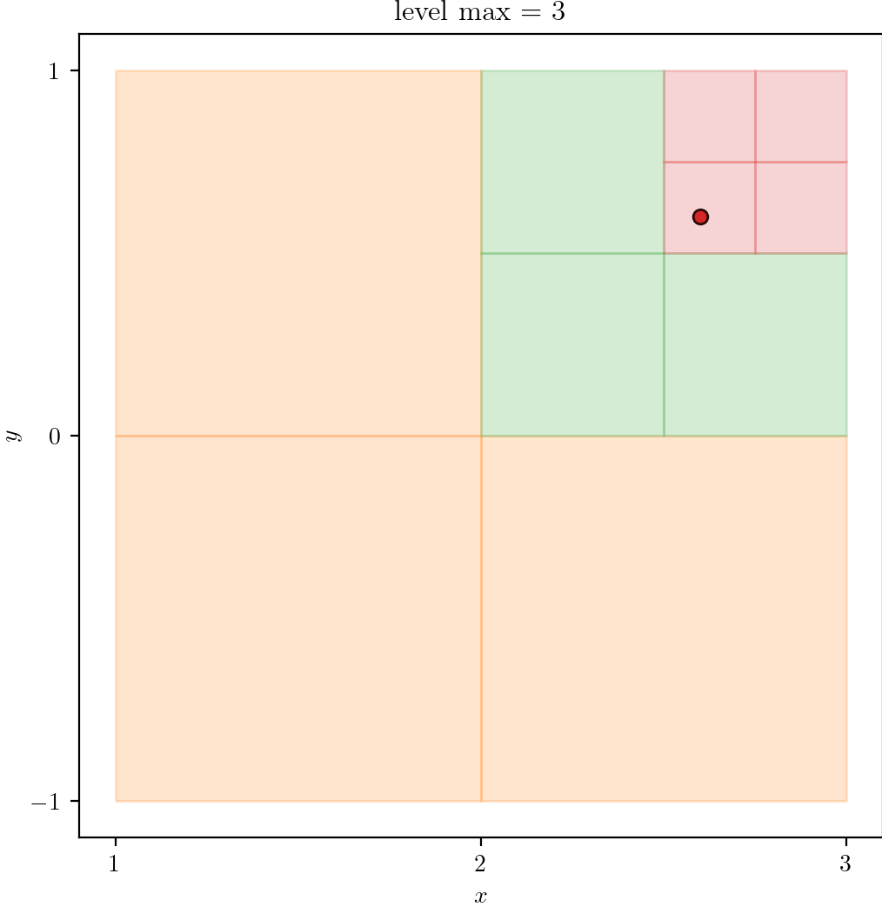
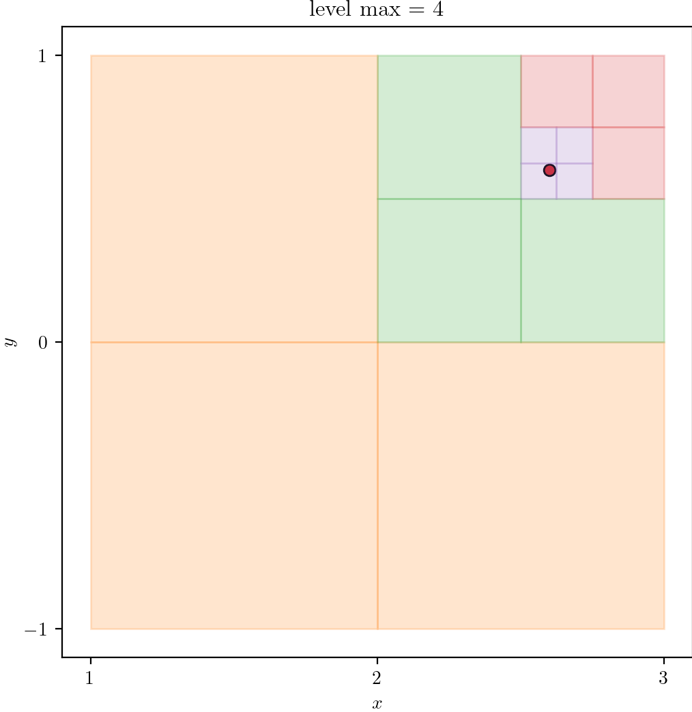
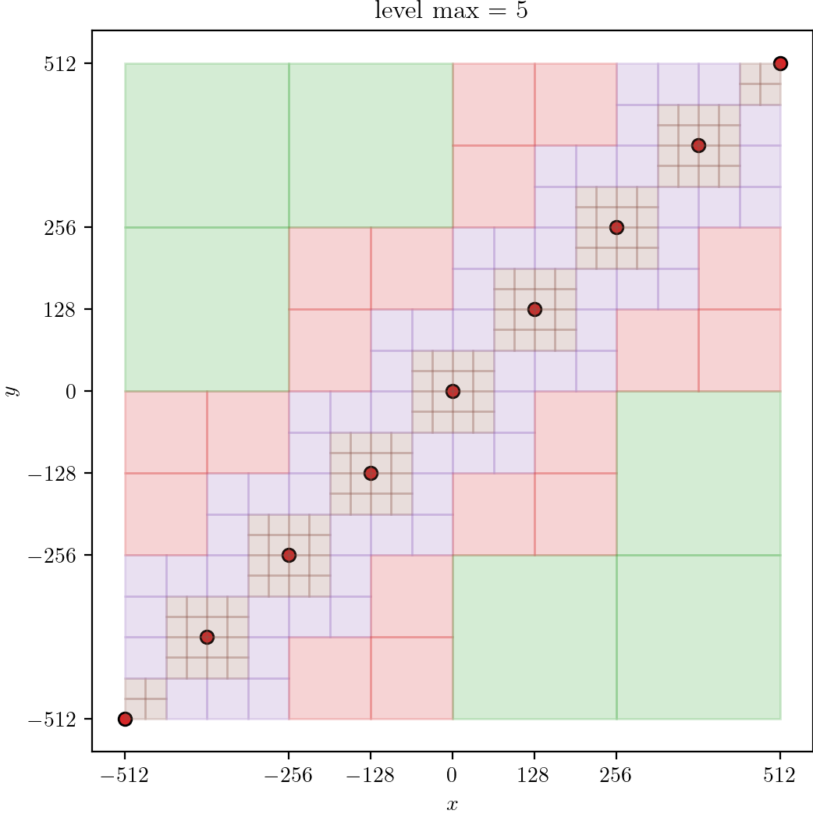
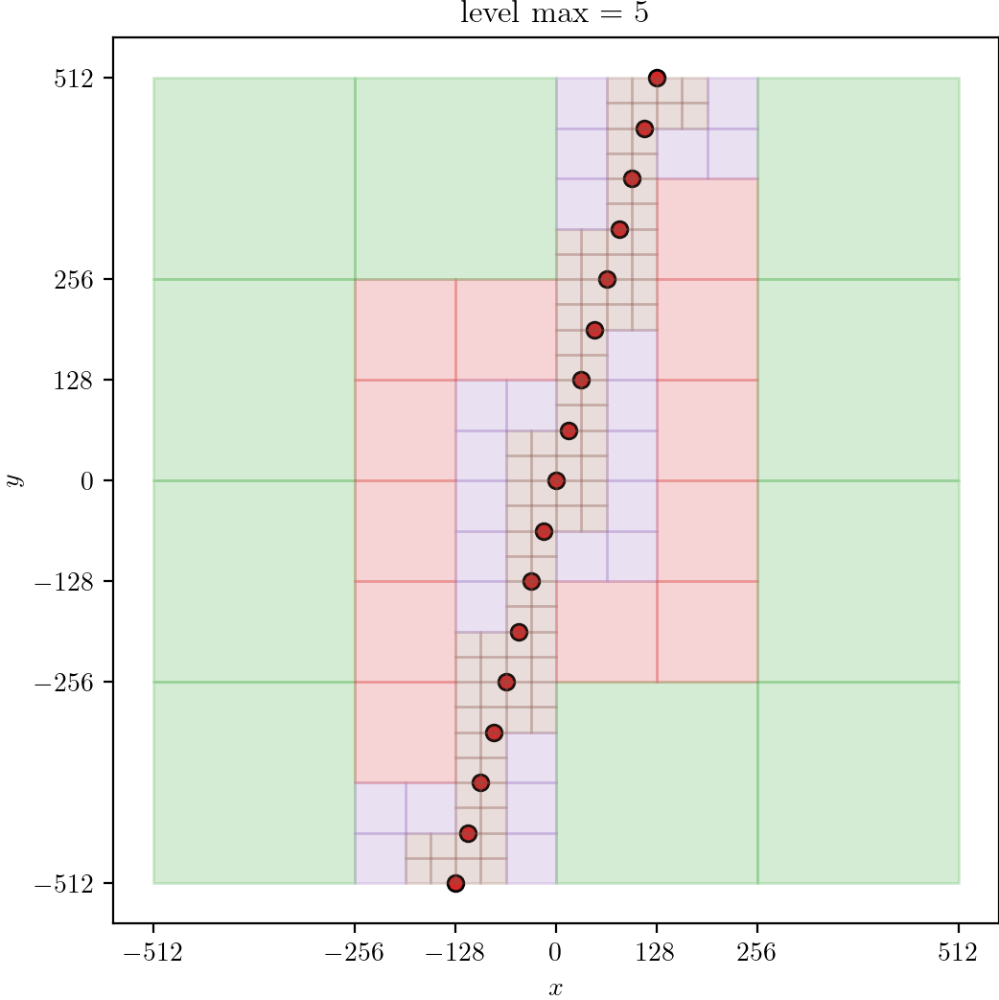

# quadtree

## Numbering Convention

* *x* is the dominant (first) axis
* *y* is the subordinant (second) axis
* Level 0: blue (0 bisections: 2^0 = 1 quad per side length)
  * Level 1: orange (1 bisection: 2^1 = 2 quads per side length)
    * Level 2: green (2 bisections: 2^2 = 4 quads per side length)
      * Level 3: red (3 bisections: 2^3 = 8 quads per side length)

Created with [plot_quadtree_convention.py](plot_quadtree_convention.py):

Created with [fig_quadtree.tex](fig_quadtree.tex):

## Refinement Example

Created with [plot_quadtree.py](plot_quadtree.py):

* `L0` square domain $$(x, y) \in ([1, 3] \otimes  [-1, 1])$$
* Single point at `(2.6, 0.6)` to trigger refinement.

| | | | 
|:---:|:---:|:---:|
 |  |  |
 |  |  |

## Rebalancing

Created with [plot_quadtree.py](plot_quadtree.py):

| before | after |
|:---:|:---:|
|  |  |
|  # boundary points = 9 | |
|  # boundary points = 5 | |
|  # boundary points = 3 | |

### Remark: Number of Boundary Points

For computation, the boundary is described by discrete boundary points that lie along the continuous boundary.  Sufficient boundary point density to approximately the continuous boundary 
* is required to maintain sufficient quad tree refinement along the path of the boundary 
* is determined by the maximum level of quad tree refinement

Compare the above three cases, with # boundary points, `nbp`, as 3, 5, 9, and respectively, # of boundary intervals, `nbi`, as 2, 4, 8.
* Assume the length dimension is in millimeters, for concreteness of this discussion.  
* All three cases have the `L0` side length as 1024-mm, and maximum number of refinements, `level_max`, as 5.  
* The smallest quad tree side length is
  * `Ln = 1024-mm / (2^n) = ...`
  * `L5 = 1024-mm / (2^5) = 32-mm`
* To maintain continuity of the 4x4 brown square region, the `L5` refinement, the boundary maximum point-to-point interval distance, `ppd_max`, in either the `x` or the `y` direction must be no greater than `4 * 32-mm`, which provides 2 side lengths from each of the two square regions, totaling 4 brown squares on the interval from point-to-point.
* Generally, if the smallest side length is `Ln = L0 / (2^n)`
  * then `ppd_max = 4 * Ln = 4 * L0 / (2^n)`
  * If the number of quad tree bisections `n` increases, the boundary maximum point-to-point interval distance `ppd_max` decreases, which makes sense.
* Also, a distinction for *open* versus *closed* boundaries:
  * `nbi`, the number of boundary intervals, relates to `npb`, the number of boundary points, as
    * `nbi = nbp` for a closed boundary, and
    * `nbi = nbp - 1` for an open boundary.
* Checking the above example
  * `ppd_max = 4 * 1024-mm / (2^5) = 128-mm`
  * This result indicates that even `npb = 9` may be insufficiently low in point density.
    * The boundary length = `sqrt(256^2 + 1024^2) = 1056-mm`.
    * For the *open* boundary example here, 
      * `nbp = 9` means there are `nbi = 8` intervals.
      * For each interval, `ppd = 1056-mm / 8 = 132-mm`, which exceeds `ppd_max = 128-mm` by 3-percent.
  * The worst-case scenario for this example would be if the boundary ran on the domain diagonal and the `nbp` remained 9.  In this case
    * The boundary length = `sqrt(1024^2 + 1024^2) = 1024 * sqrt(2) = 1448-mm`.
    * For each interval, the `ppd = 1448-mm / 8 = 181-mm`, which exceeds the `ppd_max = 128-mm` by 41-percent.  
    * This result makes sense as the `sqrt(2) = 1.41` hypotenuse factor in this configuration gives rise to the 41-percent increase.  
    * Do gaps appear in the boundary for the diagonal with `nbp = 9` case?
      * `No` if the continuity condition is vertex continuity only.
      * `Yes` if the continuity condition is edge continuity.
      * Edge continuity is a stronger continuity condition than vertex continuity.
      * The quad tree refinement changes because 
        * the `nbp = 9` results in a `ppd = 181-mm`, which exceeds `ppd_max = 128-mm` by 41-percent.  
        * With `nbp = 17` (thus `nbi = 16` for an open curve), `ppd =  90.5-mm`, which does not exceed the `ppd_max = 128-mm` value.

| `nbp = 9` | `nbp = 17` |
|:---:|:---:|
|  |  |
> Illustration of worst-case continuity condition (left) with `nbp = 9` compared to a single additional bisection (right) with `nbp = 17`.  

| `nbp = 9` | `nbp = 17` |
|:---:|:---:|
|  |  |
> Illustration of original case continuity condition (left) with `nbp = 9` compared to a single additional bisection (right) with `nbp = 17`.