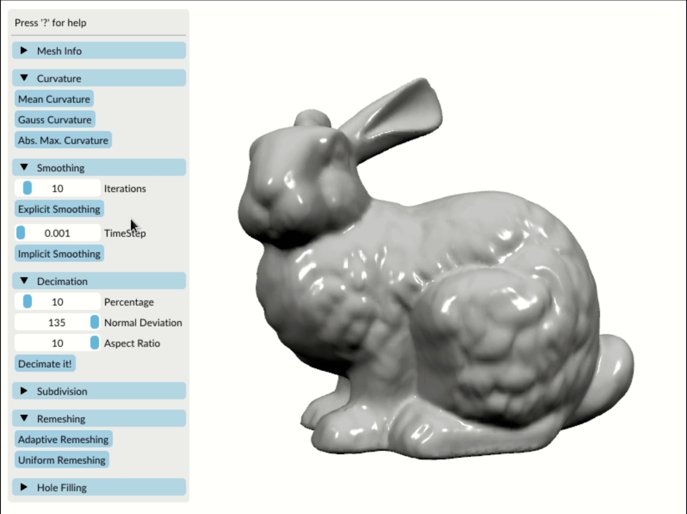
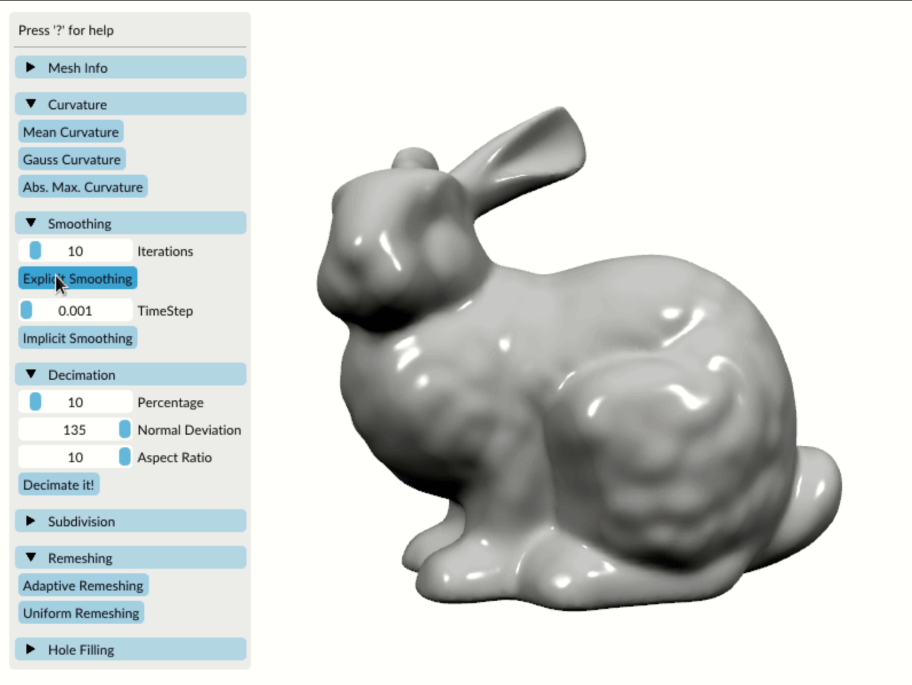
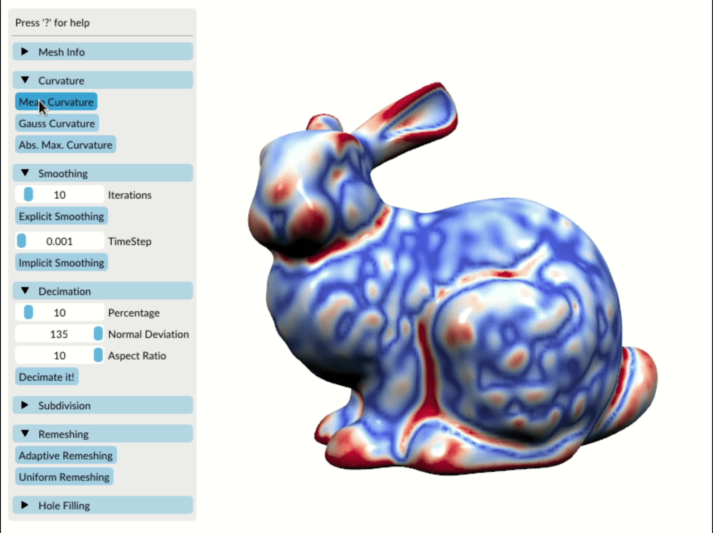

# Remeshing

* Given a mesh, find a new mesh such that
  * it satisfies the same displacement boundary conditions, and
  * it has a superior quality metric that the quality metric of the given mesh.
* Remeshing is a technique to improve *mesh quality*.
* The given mesh may be a 3D surface of triangles or quads, or a 3D volume of tets or hexes.

## Workflow

| input | smooth | curvature | decimate | remesh |
|:--:|:-:|:-:|:-:|:-:|
|  |  |  |  |  |
> *Figure 1:  Workflow using the pmp-library.*

## References

* [Alliez 2003 isotropic surface remesh](ref/Alliez_2003_isotropic_surface_remesh.pdf)
* [Alliez 2005 centroidal voronoi isotropic remesh](ref/Alliez_2005_centroidal_voronoi_isotropic_remesh.pdf)
* [Botsch 2007 geometric modeling polygonal meshes book](ref/Botsch_2007_geometric_modeling_polygonal_meshes_book.pdf)

```bash
@book{kobbelt2000geometric,
  title={Geometric modeling based on polygonal meshes},
  author={Kobbelt, Leif P and Bischoff, Stephan and Botsch, Mario and K{\"a}hler, Kolja and R{\"o}ssl, Christian and Schneider, Robert and Vorsatz, Jens},
  volume={1},
  year={2000},
  publisher={Max-Planck-Institut f{\"u}r Informatik}
}
```

* pmp-library on [GitHub](https://github.com/pmp-library/pmp-library)

```bash
@misc{pmp-library,
title  = {The Polygon Mesh Processing Library},
author = {Daniel Sieger and Mario Botsch},
note   = {http://www.pmp-library.org},
year   = {2020},
}
```
