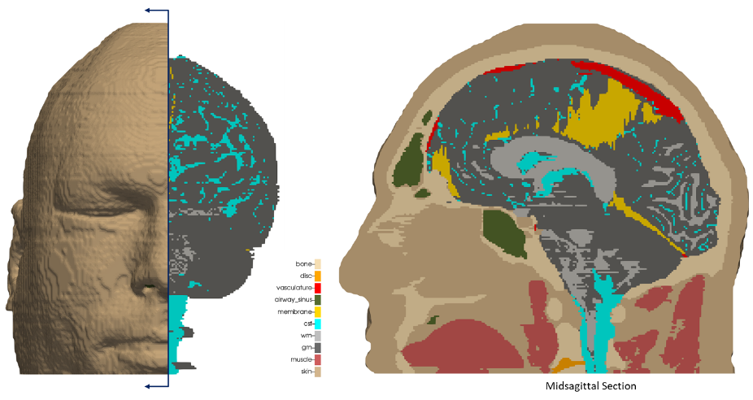
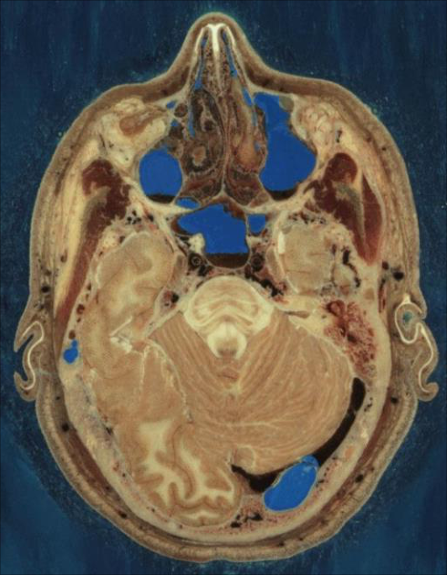
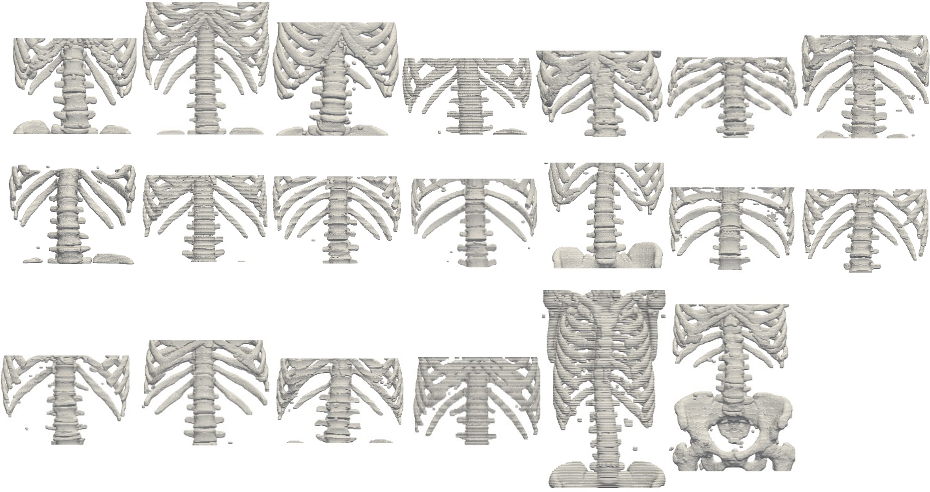

# Proposal

**Content on this page was previously released as SAND2020-9868 M, Unclassified Unlimited Release (UUR).**

## Title Page

Title: Toward the Development of a Patient-Specific Digital Twin from Medical Images

Subtitle: Deep learning workflow to create a 3D solid model of human bones from medical images without human intervention.

* C. B. Hovey, Principal Investigator
* A. A. Patel, Technical Contributor
* R. J. Terpsma, Technical Contributor
* Sandia Injury Biomechanics Laboratory (SIBL)
* Sandia National Laboratories

> Sandia National Laboratories is a multimission laboratory managed and 
operated by National Technology and Engineering Solutions of Sandia, LLC.,
a wholly owned subsidiary of Honeywell International, Inc., for the 
U.S. Department of Energy's National Nuclear Security Administration 
under contract DE-NA-0003525.

## Motivation

Advanced imaging techniques, such as computed tomography (CT) and magnetic resonance (MR) provide medical professionals with a non-invasive, high-resolution (1 mm and sub-millimeter) internal view of patient's anatomy, useful in the diagnosis and treatment of injury and disease.

Segmentation is the process of classifying individual pixels that compose a CT image as belonging to a unique anatomy.  For example, in the human head CT may contain pixels that represent skin, bone, muscle, cerebral spinal fluid (CSF), gray matter, white matter, membranes, and vasculature.

Manual segmentation is the performance of the segmentation task by a human.  Manual segmentation suffers from two significant disadvantages: 

* It is **resource intensive**.  It requires a large amount of human time, requires the human to have expertise in human anatomy and computer science.  As a result, it is also slow, because there is a human-in-the-loop.  
* Manual segmentation has **low repeatability**.  Variability exists between two humans (no two humans will perform the same segmentation) and within a human (no human, performing the manual segmentation task on the same subject on two separate occasions, will produce the same segmentation).

In contrast to manual segmentation, automated segmentation refers to the process of segmentation by a computer program, without a human in-the-loop.  "Automated" means the entire process, from CT image to geometric solid model, can be created by a computer program, without the need for human interaction.

Deep learning, with advances in algorithms (e.g., convolutional neural networks and transfer learning) and hardware (e.g., graphical processor unit), now offer hope that the segmentation bottleneck can be eliminated.  Recent efforts have demonstrated the efficacy of deep learning algorithms to identify disease in radiological studies with better accuracy than the average experienced human radiologist [[Rajpurkar 2017](#rajpurkar-2017)]. Similarly, deep learning algorithms, once trained, have been shown to autonomously build 3D solid model representations from 2D image slices.

## Background

Serving as a foundation to the current proposal are two main advances developed by the Sandia Injury Biomechanics Laboratory:

1. The Sandia high-fidelity head-neck-torso solid model (aka "Bob"), and
2. The Pixel To Mesh (PTM) workflow.

These two efforts are described in summary form to provide context to the current proposal.

### Head-Neck-Torso Digital Twin

We have created a high-fidelity head-neck-torso model.  The model, internally referred to as "Bob," has two resolutions at characteristic length scales of 2-mm (“course mesh”) and 1-mm (“fine mesh”).  The meshes exist in both a finite element and finite volume description, suited to analysis involving blast and ballistics (e.g., Eulerian) as well as blunt impact (e.g., Lagrangian).  Ten (10) materials compose the model: bone, disc, vasculature, airway/sinus, membrane, cerebral spinal fluid (CSF), white matter, gray matter, muscle, and skin.

> *Figure 1: Frontal and midsagittal views of Sandia Head-Neck-Torso Model (Bob).  Note: only the head and upper neck regions are shown in this view.*

Bob is a digital twin of the human male scan provided by the NIH U.S. National Library of Medicine [[Ackerman 1997](#Ackerman-1997), [Visible Human](#Visible-Human-2019)]

The NIH scan consists of CT and digital photography of 1,871 axial slices of the full body at 1-mm intervals (stature equivalent: 187-cm, 73.7-inch, approx. 6'-2").   CT resolution is 512-by-512 pixels, at 12 bits per pixel.  Photographic resolution is 4,096-by-2,700 pixels, at 24 bits per pixel.  MR of the head and neck also exist in axial slice intervals of 4-mm, with resolution of 256-by-256 pixels, at 12 bits per pixel.

> *Figure 2: NIH U.S. National Library of Medicine axial section.*

The Bob model was created over the course of years by a trained biologist and engineer, who manually segmented each 1-mm thick image slide into anatomical categories, such as bone, white matter, gray matter, cerebral spinal fluid, and so on.  

Manual segmentation is a profound bottleneck, which ultimately limits the number of digital twins that can be created in a reasonable timeframe.  Manual segmentation is painfully slow and tedious, highly dependent on the practitioner's judgement, not easily reproducible or transferable from one staff member to the next.  

While the current Bob model has provided significant insight for how a human body responds to blast, blunt, and ballistic environments [[SIBL 2019](#sibl-2019)],  the applicability of this model to a broader population is limited because it embodies the anatomy of one person, of a specific height, weight, and sex, at a single point in time in the post-mortem state.  To truly serve a broad and diversified human population, the manual segmentation bottleneck must be eliminated.

### Pixel To Mesh (PTM) Workflow

We are in the process of developing technology that automatically generates a digital twin of a specific human, from their medical imaging. The motivation for this effort stems from the desire to generate full-body, patient-specific digital twins of entire groups of military personnel, e.g., soldiers exposed to blast secondary to breaching activities, pilots subjected to significant spine loading from aircraft seats during ejection, or special operators subjected to repeated lower extremity and pelvic impacts from rough, open water cresting.

Recently, the SIBL demonstrated promising success with overcoming the manual segmentation bottleneck and automating the generation of digital twins through a case-study called Pixel To Mesh ("PTM").  

 (a) Image | (b) Manual Segmentation | (c) Automated Segmentation 
-|-|-
 |  | 

> *Figure 3: PTM result of class segmentation, bone versus non-bone, from (a) medical scan; (b) ground truth versus (c) machine prediction.*

PTM is a software program and computational workflow that automatically generates finite element meshes from CT scans, without the need for human intervention.  PTM is based on the deep learning algorithm called U-Net [[Ronneberger 2015](#ronneberger-2015), [Heinrich 2019](#heinrich-2019)].  

PTM was trained on the IRCAD France dataset [[IRCAD-France 2012](#ircad-france-2012)], consisting of 3D CT torso scans of 10 males and 10 females.  Once trained, PTM automatically segmented CT images into bone and non-bone with an [F1-score](https://en.wikipedia.org/wiki/F1_score) of greater than 94%.  PTM automatically created bone meshes of all 20 patients included in the IRCAD-France study.

> *Figure 4: Results of the PTM U-NET deep learning algorithm applied [[Ronneberger 2015](#ronneberger-2015)] applied to the IRCAD data set [[IRCAD-France 2012](#ircad-france-2012)].*

## Current Need

Classification of pixel values from human CT scans has been successfully undertaken by this laboratory using the U-Net deep learning algorithm. We have also demonstrated successful conversion of pixels to voxels, as a proxy for finite volume or finite element meshes. We have called these two processes, taken in serial, Pixel To Mesh (PTM).

Within the PTM workflow, we found that the mesh step quickly became intractable when the number of voxels grew past the 10s of millions. Essentially, a map of every pixel (voxel) to a single finite volume or finite element created computational domains of excessively large and equally unnecessary mesh refinement. We briefly considered concepts of element/volume decimation and coalescence but abandoned these starts because the return on time and resource investments soon appeared significantly less compelling than an alternative approach called isogeometric analysis (IGA).

The currently propose to investigate the whether or not existing segmentations can serve as geometric templates sufficient to enable automatic creation of analytic geometry, rather than a mesh.  We call this alternative workflow Pixel To Geometry (PTG). This alternative seeks to selectively use the categorized pixel values as a scaffold for construction of analytical geometric descriptions in 2D and 3D. Thereafter, we propose using the analytical geometries directly in simulation using IGA, which eliminates the mesh step.

> *Figure 5: Illustration of Pixel To Mesh (PTM) and Pixel To Geometry (PTG) workflows.*

## Plan

* The **goal** of is to create and demonstrate an exemplar deep learning algorithm to create a 3D solid model of the human skeleton subset from medical images without human intervention.
* The **scope** of this study will be limited to reconstruction of bone from CT data.  Soft tissue and MR data are outside of the scope. 
* The **deliverables** will be
  * A **presentation** of the prototypical method, from CT to mesh, and
  * An **open-source code repository** to share our developments with future collaborators.
* Implementation will reside on the Sandia Injury Biomechanics Laboratory (SIBL) GitHub repository, [https://github.com/sandialabs/sibl](https://github.com/sandialabs/sibl), under *Grant Letter Open Source Software (OSS) SCR# 2462.0*.
* A **second deliverable**, scaling of algorithm application from one-to-many bones, is offered to the sponsor, should interest and funding exist.

## Impact

This pilot study will create a tangible milestone, demonstrating the possible connection between pixel-derived information, encoded in medical images, and analytical geometry models that, when scanned, might regenerate the original pixel data.

Successful execution of this proof-of-concept exemplar will demonstrate the progress toward the generation full-body, patient-specific digital twins of entire groups of military personnel.

The development of large digital libraries of military personnel anatomy requires an automated approach.  Manual approaches far too slow and labor-intensive to generate anything more than a single example class (e.g., female 5th percentile, male 50th percentile, male 95th percentiles), which are not as precise as patient-specific models.

## Cost

The Rough Order of Magnitude (ROM) is attached hereto as Appendix A.  *[Appendix A is not included in open source content.]*

## Point of Contact

Inquiries pertaining to this proposal should be directed to:

* Douglas Dederman, Department Manager, Terminal Ballistics Technology; or,
* Chad Hovey, Principal Investigator, Terminal Ballistics Technology

Department 5421, Sandia National Laboratories, PO Box 5800,  Albuquerque NM 87185-MS1160 

## References

### Ackerman 1997

* Ackerman MJ. (1997).  The Visible Human Project:  A resource for anatomical visualization. In Information Technology Applications in Biomedicine. ITAB'97. Proceedings of the IEEE Engineering in Medicine and Biology Society Region 8 International Conference Sep 7 (pp. 29-31), IEEE.

### Heinrich 2019

* Heinrich, G. (2016). Image Segmentation Using DIGITS 5. https://devblogs. nvidia.com/image-segmentation-using-digits-5 accessed April 22, 2020.

### IRCAD-France 2012

* IRCAD-France (2012). 3D-IRCADb 01 database, 3D CT-scans of 10 women and 10 men. https://www.ircad.fr/research/3d-ircadb-01/ accessed August 29, 2019.

### Rajpurkar 2017

* Rajpurkar P, Irvin J, Zhu K, Yang B, Mehta H, Duan T, Ding D, Bagul A, Langlotz C, Shpanskaya K, Lungren MP. (2017). Chexnet: Radiologist-level pneumonia detection on chest x-rays with deep learning. arXiv preprint arXiv:1711.05225, Nov 14. See https://arxiv.org/pdf/1711.05225.pdf%202017.pdf.

### Ronneberger 2015

* Ronneberger, O., Fischer, P., and Brox, T. (2015). U-net: Convolutional networks for biomedical image segmentation. In International Conference on Medical image computing and computer-assisted intervention, pages 234–241. Springer. https://arxiv.org/abs/1505.04597.

### SIBL 2019

* See https://www.sandia.gov/biomechanics/, accessed November 18, 2019.

### Visible Human 2019 

* See https://www.nlm.nih.gov/research/visible/visible_human.html, accessed November 18, 2019.

