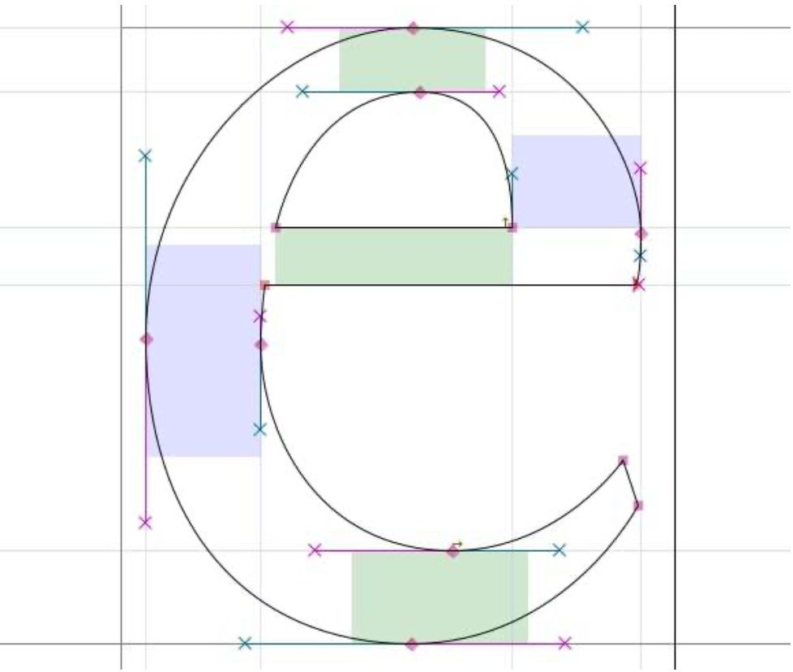

# unit test - font

Demonstration of the Pixel To Geometry (PTG) workflow through an example of binary classification.

## Introduction

* Font designers often use cubic Bezier curves to create digital fonts. 
* Here, we use the creation of two [templates](definitions.md#template) (the letters "e" and "a") to test the Bezier creation our PTG workflow.
* Next, we demonstrate the **encoding** of templates to data [slices](definitions.md#slice).
* Next, we demonstrate **class segmentation** for singletons.
* Next, we demonstrate **instance segmentations** for populations.
* Finally, we demonstrate **reconstruction**

## Objective

* Demonstrate viability of the PTG workflow with a relative simple and quick to run model.
* Discover lurking (*a priori* unanticipated) workflow variables, data, or algorithms needed to complete the workflow.

## Methods

### Data

* We restrict our study to two letters, "e" and "a".  
  * We encode the "e" prior to the "a" because the former is easier, requiring fewer Bezier curves.
  * Restriction to two known states and a test for the states composes the framework of binary classification.
  * The letter "e" from [Design With FontForge](https://drive.google.com/file/d/1lT1O3lM3liIpdv74NJHczz7yXLsEY8vA/view?usp=sharing) [@FontForge2017]
  * 
  * > Figure.  The letter "e", composed of Bezier curves. @FontForge2017 from page 45.
  * The letter "a"
  * 
  * > Figure.  The letter "a", composed of Bezier curves. @FontForge2017 from page 46.

<!---  -->
<!---  -->

### Workflow

We define the PTG workflow as

* Create templates from analytic geometry, in this case, cubic Bezier curves.
  * Create human-recognizable objects from our Bezier geometry factory,
  * Create a library composed of two templates, which is then suitable to be used in a binary classification problem, with metrics, e.g., sensitivity and specificity, to adjudicate the quality of the decode algorithm.
* Encode the geometry into slices.
  * There is a pixel
    * pix_len_H (double): Horizontal pixel length of (1/resolution_H), typically 1-mm
    * pix_len_V (double): Vertical pixel length of (1/resolution_V), tyically 1-mm
    * Pixel shape isotropy is a special case when 
      * pix_len_H = pix_len_V = pix_len: square shaped pixels with side length of 1-mm
      * This gives rise to the concept of (isotropic) **resolution**, historically with units of dpi (dots per inch or pixels per inch).  Here we state resolution in units of pixels-per-millimeter (ppmm).
      * Example: Early laser printers specified a resolution of 150 dpi (dots per inch, or equivalently, pixels per inch) = 5.91 dots per mm, thus pix_len = 0.169-mm.  Later laser printers doubled the resolution to 300 dpi.  
  * There is a bounding box
    * n_pix_H (int): number of horizontal pixels
    * n_pix_V (int): number of vertical pixels
    * bb_len_H (double, derived mm):  horizontal length =  pix_len * n_pix_H
    * bb_len_V (double, derived mm): vertical length = pix_len * n_pix_V
    * The *t*-axis 
      * originates in the top-left corner of the bounding box and 
      * is directed vertically down, toward the bottom of the page, and 
      * is the major axis
    * The *u*-axis 
      * originates in the top-left corner of the bounding box and 
      * is directed horizontally across, toward the right of the page, and
      * in the minor axis
  * A slice is a sequence, at a given value of *t* along the *t*-axis, along the *u*-axis with *u*-index [0, 1, ... n_pix_H).
    * Slices have a category of '1' if the pixel is a member of the set of the encoded template (e.g., font shape composing the letter "e" or "a")
    * Slices have category '0' otherwise.
    * There are [0, 1, ... n_pix_V) slices, which, when stacked vertically, compose the bounding box. 

* Decode the slices:
  * Categorize the encoding.
  * Reconstruct the analytic geometry.
    * Translation left-right the page (horizontal).
    * Translation top-bottom on the page (vertical).
    * Rotation within the page.
    * Scale, increase or decrease in font size.

## Results

To come.

## Discussion

* This approach honors the "simple-to-complex" build philosophy of software development, wherein components are proven viable through simple-to-understand and quick-to-run unit tests, prior to their integration into the software system.

## Conclusion

To come.

## Appendix

<!---  -->

> Figure.  The letter "g", composed of Bezier curves. @FontForge2017 from page 47.

## References

* [Apple TrueType]https://developer.apple.com/fonts/TrueType-Reference-Manual/RM01/Chap1.html) Digitizing Letterform Designs
* [Design with FontForge](http://designwithfontforge.com/en-US/index.html)
* [The Bezier Game](https://bezier.method.ac/)

