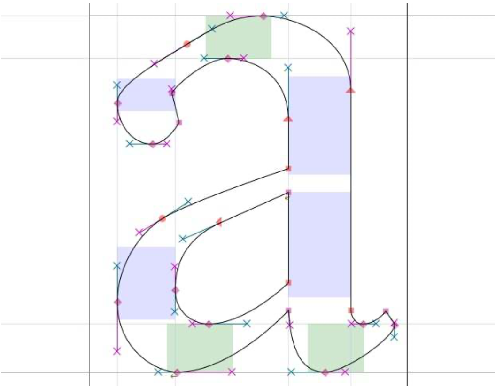
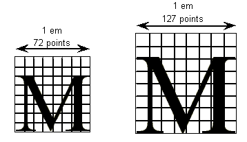
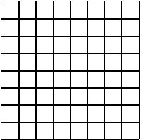

# unit test - font

## Title

Demonstration of the Pixel To Geometry (PTG) workflow through an example of binary classification.

## Introduction

* Font designers often use cubic Bezier curves to create digital fonts. 
* Here, we use the creation of two [templates](definitions.md#template) (the letters "e" and "a") to test the Bezier creation our PTG workflow.
* Next, we demonstrate the **encoding** of templates to data [slices](definitions.md#slice-and-solid).
* Next, we demonstrate **class segmentation** for singletons.
* Next, we demonstrate **instance segmentations** for populations.
* Finally, we demonstrate **reconstruction**

## Objective

* Articulate the major components of the PTG workflow.
* Demonstrate **viability** of the PTG workflow with a model that is good, cheap, and fast (choose any **three** paradigm):
  * good - the model is **reproducable** and yields **accurate** results ("consistent" and "correct"),
  * cheap: the model is relatively simple,
  * fast: the workflow is quick-to-run; and is
  * an abstraction of more complex models (e.g., the human skeleton) and workflows (e.g., PTG of a human CT scan).
* Discover lurking (*a priori* unanticipated) variables, data, or algorithms needed to complete the workflow.

## Methods

### Data

* We restrict our study to two letters, "e" and "a".  
  * We encode the "e" prior to the "a" because the former is easier, requiring fewer Bezier curves.
  * Restriction to two known states and a test for the states composes the framework of binary classification.
  * The letter "e" from [Design With FontForge](https://drive.google.com/file/d/1lT1O3lM3liIpdv74NJHczz7yXLsEY8vA/view?usp=sharing) [@FontForge2017]
  * 
  * > Figure.  The letter "e", composed of Bezier curves. @FontForge2017 from page 45.
  * The letter "a"
  * 
  * > Figure.  The letter "a", composed of Bezier curves. @FontForge2017 from page 46.

<!---  -->
<!---  -->

### Workflow

We define the PTG workflow as

* Create templates from analytic geometry, in this case, cubic Bezier curves.
  * Create human-recognizable objects from our Bezier geometry factory,
    * letter-e
      * [config](../data/letter-e-config.json)
      * [control points](../data/letter-e-control-points.csv)
      * [control nets](../data/letter-e-control-nets.csv)
      * Results:
        * 
        * > [Figure](fig/letter-e-slice.png): letter e, slice view.
        * 
        * > [Figure](fig/letter-e-iso.png): letter e, isometric view.
  * Create a library composed of two templates, which is then suitable to be used in a binary classification problem, with metrics, e.g., sensitivity and specificity, to adjudicate the quality of the decode algorithm.
* Encode the geometry into slices.
  * There is a pixel
    * pix_len_H (double): Horizontal pixel length of (1/resolution_H), typically 1-mm
    * pix_len_V (double): Vertical pixel length of (1/resolution_V), tyically 1-mm
    * Pixel shape isotropy is a special case when 
      * pix_len_H = pix_len_V = pix_len: square shaped pixels with side length of 1-mm
      * This gives rise to the concept of (isotropic) **resolution**, historically with units of dpi (dots per inch or pixels per inch).  Here we state resolution in units of pixels-per-millimeter (ppmm).
      * Example: Early laser printers specified a resolution of 150 dpi (dots per inch, or equivalently, pixels per inch) = 5.91 dots per mm, thus pix_len = 0.169-mm.  Later laser printers doubled the resolution to 300 dpi.  
  * There is a bounding box
    * n_pix_H (int): number of horizontal pixels
    * n_pix_V (int): number of vertical pixels
    * bb_len_H (double, derived mm):  horizontal length =  pix_len * n_pix_H
    * bb_len_V (double, derived mm): vertical length = pix_len * n_pix_V
    * The *t*-axis 
      * originates in the top-left corner of the bounding box and 
      * is directed vertically down, toward the bottom of the page, and 
      * is the major axis
    * The *u*-axis 
      * originates in the top-left corner of the bounding box and 
      * is directed horizontally across, toward the right of the page, and
      * in the minor axis
  * A slice is a sequence, at a given value of *t* along the *t*-axis, along the *u*-axis with *u*-index [0, 1, ... n_pix_H).
    * Slices have a category of '1' if the pixel is a member of the set of the encoded template (e.g., font shape composing the letter "e" or "a")
    * Slices have category '0' otherwise.
    * There are [0, 1, ... n_pix_V) slices, which, when stacked vertically, compose the bounding box. 

* Decode the slices:
  * Categorize the encoding.
  * Reconstruct the analytic geometry.
    * Translation left-right the page (horizontal).
    * Translation top-bottom on the page (vertical).
    * Rotation within the page.
    * Scale, increase or decrease in font size.

## Results

To come.

## Discussion

* This approach honors the "simple-to-complex" build philosophy of software development, wherein components are proven viable through simple-to-understand and quick-to-run unit tests, prior to their integration into the software system.

## Conclusion

To come.

## Appendix

<!---  -->

> Figure.  The letter "g", composed of Bezier curves. @FontForge2017 from page 47.

## References

* [Apple TrueType](https://developer.apple.com/fonts/TrueType-Reference-Manual/RM01/Chap1.html) Digitizing Letterform Designs
* [The Bezier Game](https://bezier.method.ac/)
* [Design with FontForge](http://designwithfontforge.com/en-US/index.html)
* [Healy, Kieran](https://github.com/kjhealy) data science, typography, LaTeX to HTML and pdf.
* [Microsoft Typography](https://docs.microsoft.com/en-us/typography/)
  * [Outlines](https://docs.microsoft.com/en-us/typography/opentype/spec/ttch01?ranMID=24542&ranEAID=je6NUbpObpQ&ranSiteID=je6NUbpObpQ-D86ya3ymD0tFbE._fTu.4A&epi=je6NUbpObpQ-D86ya3ymD0tFbE._fTu.4A&irgwc=1&OCID=AID2000142_aff_7593_1243925&tduid=%28ir__ue3z6b1hvwkftgwikk0sohzg2n2xipoz11wfkxjk00%29%287593%29%281243925%29%28je6NUbpObpQ-D86ya3ymD0tFbE._fTu.4A%29%28%29&irclickid=_ue3z6b1hvwkftgwikk0sohzg2n2xipoz11wfkxjk00#outlines)
    * "In a TrueType font, glyph shapes are described by their outlines. A glyph outline consists of a series of contours. A simple glyph may have only one contour. More complex glyphs can have two or more contours. Composite glyphs can be constructed by combining two or more simpler glyphs. Certain control characters that have no visible manifestation will map to the glyph with no contours."
    * "Contours are composed of straight lines and curves. Curves are defined by a series of points that describe second ~~order~~ [*sic*, degree, *p=2*, quadratic] Bezier-splines. The TrueType `Bezier­spline` format uses two types of points to define curves, those that are on the curve and those that are off the curve. Any combination of off and on curve points is acceptable when defining a curve. Straight lines are defined by two consecutive on curve points."
  * Font Units (FUnits) and the [em square](https://docs.microsoft.com/en-us/typography/opentype/spec/ttch01?ranMID=24542&ranEAID=je6NUbpObpQ&ranSiteID=je6NUbpObpQ-D86ya3ymD0tFbE._fTu.4A&epi=je6NUbpObpQ-D86ya3ymD0tFbE._fTu.4A&irgwc=1&OCID=AID2000142_aff_7593_1243925&tduid=%28ir__ue3z6b1hvwkftgwikk0sohzg2n2xipoz11wfkxjk00%29%287593%29%281243925%29%28je6NUbpObpQ-D86ya3ymD0tFbE._fTu.4A%29%28%29&irclickid=_ue3z6b1hvwkftgwikk0sohzg2n2xipoz11wfkxjk00#funits-and-the-em-square)
    * "A key decision in digitizing a font is determining the resolution at which the points that make up glyph outlines will be described. The points represent locations in a grid whose smallest addressable unit is known as an FUnit or font Unit. The grid is a two-dimensional coordinate system whose x-axis describes movement in a horizontal direction and whose y-axis describes movement in a vertical direction. The grid origin has the coordinates (0,0). The grid is not an infinite plane. Each point must be within the range -16384 and +16383 FUnits. Depending upon the resolution chosen, the range of addressable grid locations will be smaller."
    * "The choice of the granularity of the coordinate grid-that is, number of units per em (**upem**)-is made by the font manufacturer. Outline scaling will be fastest if units per em is chosen to be a power of 2, such as 2048 [2^11]."
    * 2^14 = 16384.  The positive goes only to 16383 because it also contains the zero coordinate, for a total of 16834 units.
    * 
    * "Figure 1-4: The [FUnit] coordinate system."
    * 
    * "Figure 1-5: Two possible choices for the glyph origin in a Roman font. In the first case (left) the left side bearing is x-zero. In the second (right), the aesthetic center of the character is x-zero."
    * "FUnits are relative units because they vary in size as the size of the em square changes. The number of units per em remains constant for a given font regardless of the point size."
    * 
    * "Figure 1-7: [A] 72 point M and 127 point M and their em squares. Upem equals 8 in both cases."
    *  
    * "Figure 1-6: Two em squares, 8 units per em (left), 16 units per em (right)"
    * "Because FUnits are relative to the em square, a given location on a glyph will have the same coordinate location in FUnits regardless of the point size at which the font is rendered. This is convenient because it makes it possible to instruct outline points once considering only the original outline and have the changes apply to the glyph at whatever size and resolution it is ultimately rendered."
  * [Convert FUnit to Pixels](https://docs.microsoft.com/en-us/typography/opentype/spec/ttch01?ranMID=24542&ranEAID=je6NUbpObpQ&ranSiteID=je6NUbpObpQ-D86ya3ymD0tFbE._fTu.4A&epi=je6NUbpObpQ-D86ya3ymD0tFbE._fTu.4A&irgwc=1&OCID=AID2000142_aff_7593_1243925&tduid=%28ir__ue3z6b1hvwkftgwikk0sohzg2n2xipoz11wfkxjk00%29%287593%29%281243925%29%28je6NUbpObpQ-D86ya3ymD0tFbE._fTu.4A%29%28%29&irclickid=_ue3z6b1hvwkftgwikk0sohzg2n2xipoz11wfkxjk00#converting-funits-to-pixels)
  * [Display Device Characteristics](https://docs.microsoft.com/en-us/typography/opentype/spec/ttch01?ranMID=24542&ranEAID=je6NUbpObpQ&ranSiteID=je6NUbpObpQ-D86ya3ymD0tFbE._fTu.4A&epi=je6NUbpObpQ-D86ya3ymD0tFbE._fTu.4A&irgwc=1&OCID=AID2000142_aff_7593_1243925&tduid=%28ir__ue3z6b1hvwkftgwikk0sohzg2n2xipoz11wfkxjk00%29%287593%29%281243925%29%28je6NUbpObpQ-D86ya3ymD0tFbE._fTu.4A%29%28%29&irclickid=_ue3z6b1hvwkftgwikk0sohzg2n2xipoz11wfkxjk00#display-device-characteristics)
    * "The resolution of any particular display device is specified by the number of dots or pixels per inch (dpi) that are displayed. For example, a VGA under Windows is treated as a 96 dpi device, and most laser printers have a resolution of 300 dpi."
    * "Some devices, such as an EGA, have different resolution in the horizontal and vertical directions (i.e. non-square pixels); in the case of the EGA this resolution is 96 x 72. In such cases, horizontal dots per inch must be distinguished from vertical dots per inch."
    * "If you know the **ppem**, the formula to convert between FUnits and pixel space coordinates is:
      * pixel_coordinate = em_coordinate * ppem / upem
      * An em_coordinate position of (1024, 0) would yield a device_pixels coordinate of (6, 0), given 2048 units per em and 12 pixels per em."
  * [The Science of Word Recognition](https://docs.microsoft.com/en-us/typography/develop/word-recognition)

