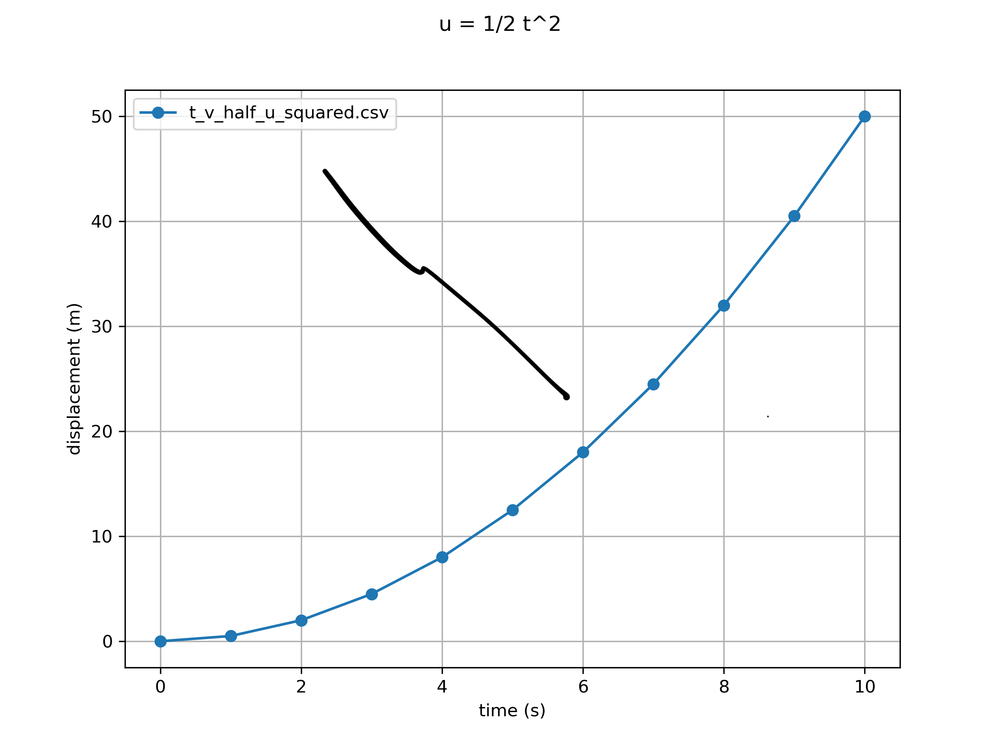

# Image Same or Different

*Used to prevent regressions.*

## Test Small Files 

* Test two files, without alpha channel  and , original and clone, respectively

* Test three files, with alpha channel
, , and , original, clone, and different, respectively.

## Test Larger Files

* The .png output figure from [t_v_half_u_squared_test.json](t_v_half_u_squared_test.json) was renamed to image_diff_test.png:

* A duplicate image was then created as image_diff_test_clone.png:

* A final modified image image_diff_test_diff.png was created:

The test script [image_diff_test.py](image_diff_test.py) is then used to assess same or different status.
