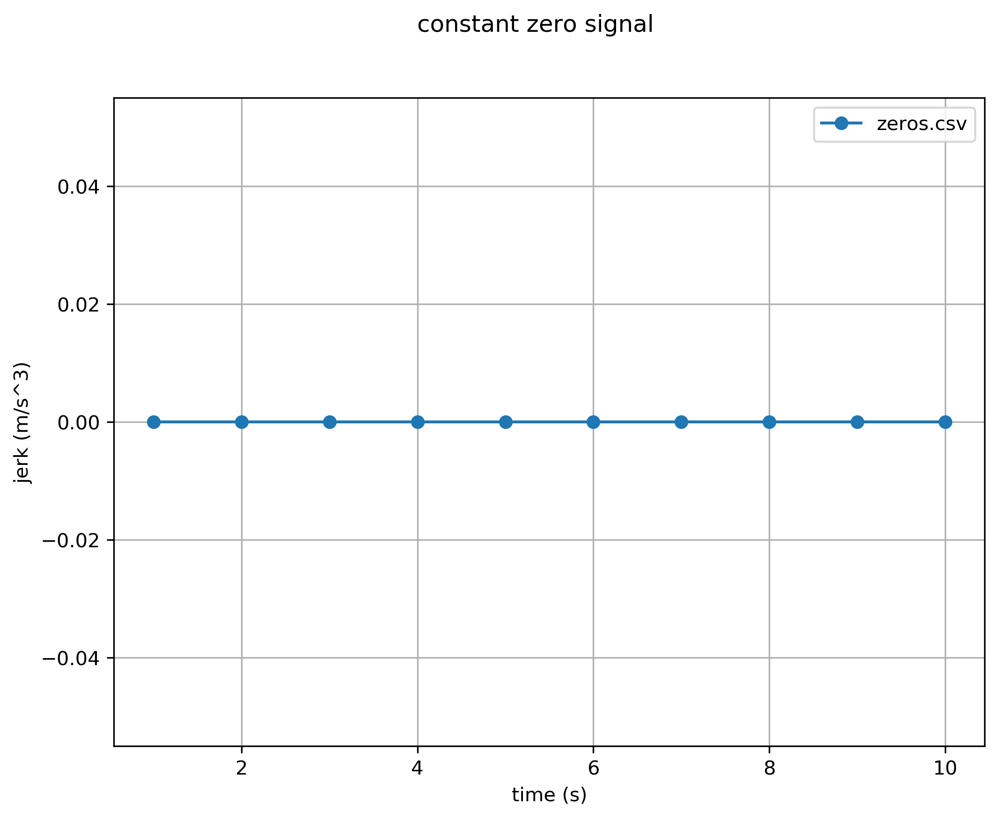

# Integration

**Important Note:**  The initial conditions are in units of the native signal.
Therefore, if the native signal will be scaled (e.g., going from m/s^2 to 
G or *vice versa*), care must be taken on the units of the initial conditions.
The initial conditions are applied **before** any scaling.  

## Constant Function

* constant zero jerk (m/s^3) with
[zeros.json](zeros.json):

* then triple integration with initial conditions:
  * `u''(0) = -10` m/s^2
  * `u'(0) = 100` m/s
  * `u(0) = 1000` m
  
Implemented with [zeros-int3.json](zeros-int3.json), 
resulting in zeros-int3.png 
and the signal process output file (triple integration of 
jerk to get displacement) as [zeros-int3.csv](zeros-int3.csv).

The closed form solution for the acceleration is
* `u''(t) = int(u''') dt + u''(0) = -10 * [1 1 1 1 1 1 1 1 1 1 1]` m/s^2
* `-----> = -10` m/s^2

The closed form solution for the velocity is
* `u'(t) = int(u'') dt + u'(0) = -10 [0 1 2 3 4 5 6 7 8 9 10] + 100` m/s
* `----> = -10*t + 100` m/s
* `----> =  [100 90 80 70 60 50 40 30 20 10 0]` m/s

The closed form solution for the displacement is
* `u(t) = int(u') dt + u(0)`
* `---> = -5*t^2 + 100*t + 1000` m
* `---> = 1000 + [0 95 180 255 320 375 420 455 480 495 500]`
